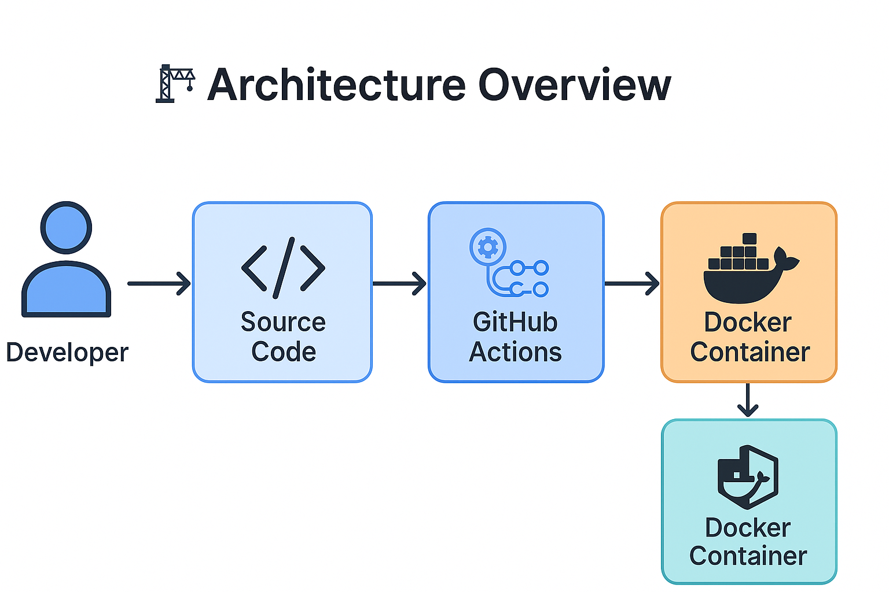

# 🚀 Flask CI/CD Demo – Automated Docker Build Pipeline

Welcome! This repo is a simple but powerful example of using **GitHub Actions** to automate building a Docker image from a Flask web app. Every push to `main` triggers a CI pipeline that builds (and optionally pushes) the Docker image—demonstrating core CI/CD principles in a clean, reproducible way.

---

## 📦 **Tech Stack**

- Python 3.9
- Flask
- Docker
- GitHub Actions
- Docker Buildx
- (Optional: Docker Hub + Portainer)

---

## 🏗️ **Architecture Overview**

✅ Every push triggers a fresh Docker build in GitHub’s CI environment  
✅ Verifies Dockerfile + app work together  
✅ Ready for manual or automated deployment to homelab or cloud

---

## 🔄 **CI/CD Pipeline Workflow**

1. Code pushed to `main` branch
2. GitHub Actions checks out repo
3. Docker Buildx builds Docker image
4. (Optional) Image pushed to Docker Hub
5. Portainer or local Docker pull → redeploy container

---

## 🏃 **How to Run Locally**

1. Clone this repo
2. Build Docker image:

run:
docker build -t my-flask-app .
docker run -d -p 8080:80 my-flask-app
	3.	Visit http://localhost:8080

✅ Done!

⸻

## 🔭 Future Enhancements
	•	Automate Docker image push to Docker Hub
	•	Auto-deploy to Portainer via webhook or Watchtower
	•	Add basic CI test step (linting, etc.)
	•	Expand app functionality (API endpoint, auth)

⸻

